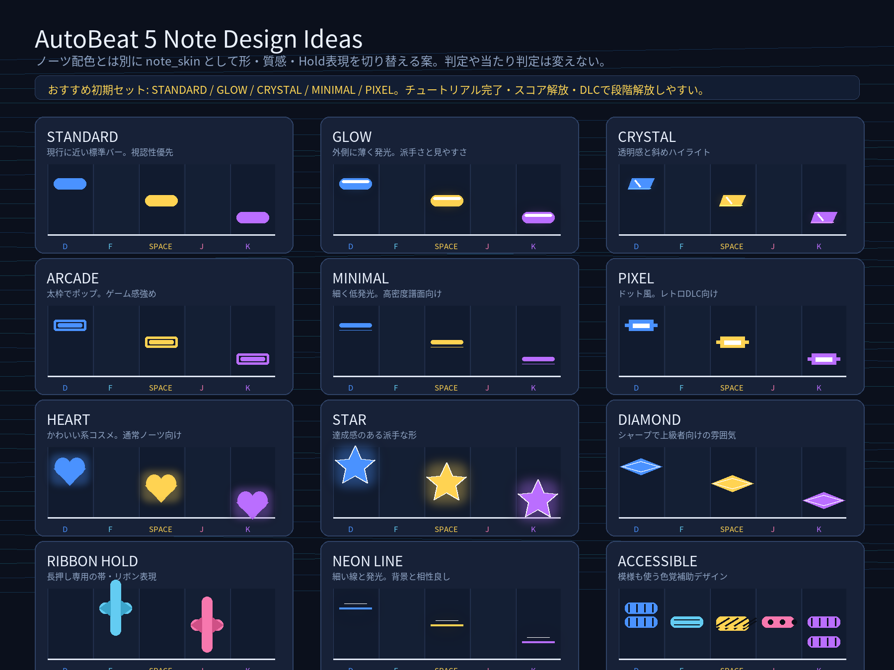

# Note Skin Visual Ideas

ノーツ配色とは別に、形・質感・長押し表現を切り替える `note_skin` の検討資料です。
判定範囲やスコアには影響させず、見た目だけを変更するコスメ要素として扱います。

## Recommended First Set

| Skin | Role | Unlock Idea |
| --- | --- | --- |
| STANDARD | 現行互換の標準 | 初期解放 |
| GLOW | 派手で分かりやすい発光 | チュートリアル完了 |
| CRYSTAL | 透明感のある解放報酬向け | 累積スコア |
| MINIMAL | 高密度でも読みやすい実用系 | チュートリアル完了 |
| PIXEL | レトロDLC向け | DLCまたは累積スコア |

## Other Candidates

| Skin | Notes |
| --- | --- |
| ARCADE | 太枠で音ゲーらしさが強い。低解像度でも見やすい。 |
| HEART / STAR / DIAMOND | キャラクターやイベントDLC向け。派手なので高密度譜面では控えめ表示が必要。 |
| RIBBON HOLD | Holdノーツ専用スキンとしてかなり相性が良い。 |
| NEON LINE | オーディオビジュアライザー背景と相性が良い。細すぎると見落とすので発光必須。 |
| ACCESSIBLE | 色だけに頼らず模様を持たせる。色覚補助設定としても使える。 |

## Implementation Notes

- `note_theme`: 色セット。
- `note_skin`: 形状・質感・Hold表現。
- `note_theme` と `note_skin` は組み合わせ可能にする。
- 追加DLCは `note_skin.<id>` としてカタログへ追加する。
- 未解放スキンはSETTINGSでLOCKED表示にする。
